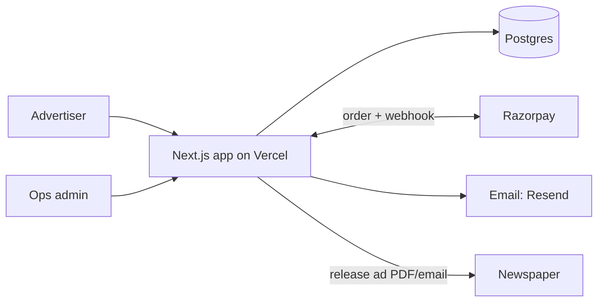

# Architecture Decision — Newspaper Ad Booking Platform

**Decision:** One Next.js modular monolith on Postgres, with a payments ledger written idempotently from Razorpay webhooks, and a manual ops queue that releases ads to newspapers by email.

## Constraints
- **C1 Money:** every booking is paid upfront. Payments must be idempotent and auditable, and refunds must be traceable.
- **C2 Publisher integration is manual:** newspapers take ad material by email or through agency portals. No API exists (`VERIFY` per publisher).
- **C3 Catalogue-heavy reads:** about 100 reads (browsing papers, editions, rates) for every write (a booking).
- **C4 Pricing varies:** price per line, per word, or per sq. cm; edition multipliers; combo packages; GST at 5% (`VERIFY` with a CA).
- **C5 Small team:** 1–3 devs and no on-call rotation.
- **C6 Load:** low, with bursts around festival dates. Expect fewer than 50 bookings per minute at peak.
- **C7 Legal:** you need an agency accreditation or commercial agreement with each newspaper, such as INS accreditation (`VERIFY`). **This blocks launch, not the technology.**

## Axes
| Axis | Choice |
|---|---|
| Topology | **Modular monolith** (C5, C6) |
| Flow | Request/response, plus webhooks for payments (C1) |
| Code shape | Layered, with one port: `PricingRule` (C4) |

## Scoring
| Pattern | Verdict | Why |
|---|---|---|
| Modular monolith | ADOPT | C5, C6 |
| Microservices | REJECT | No scaling pressure (C6). The team is too small (C5). |
| Serverless | SCOPED | Fine as the Vercel hosting for the monolith (C6) |
| Event sourcing | REJECT | An append-only `payments` ledger table covers C1 |
| CQRS | DEFER | CDN/ISR caching of the rate catalogue covers C3 |
| Hexagonal | SCOPED | Only pricing and payment-gateway adapters need it (C4, C1) |

## Topology


## Critical flow
```mermaid
sequenceDiagram
  User->>App: compose ad + dates
  App->>App: price = PricingRule(ad)
  App->>Razorpay: create order (booking_id as receipt)
  User->>Razorpay: pay
  Razorpay->>App: webhook payment.captured
  App->>DB: insert payment ON CONFLICT DO NOTHING; booking=PAID
  App->>User: confirmation email
  Ops->>Newspaper: release ad; booking=RELEASED
```

## Invariant (enforced in CI)
The server always recomputes the price. The client total is display-only. A booking becomes `PAID` **only** through a verified webhook.

## When to split
Extract only when an actual publisher API exists for automated release. That release becomes a worker reading a queue.

## Risks
- Ad rates go stale → put a `rates.valid_until` date on every rate and show an admin warning.
- Content compliance (obituaries, matrimonial ads, ad law) → ops reviews every ad before release.
